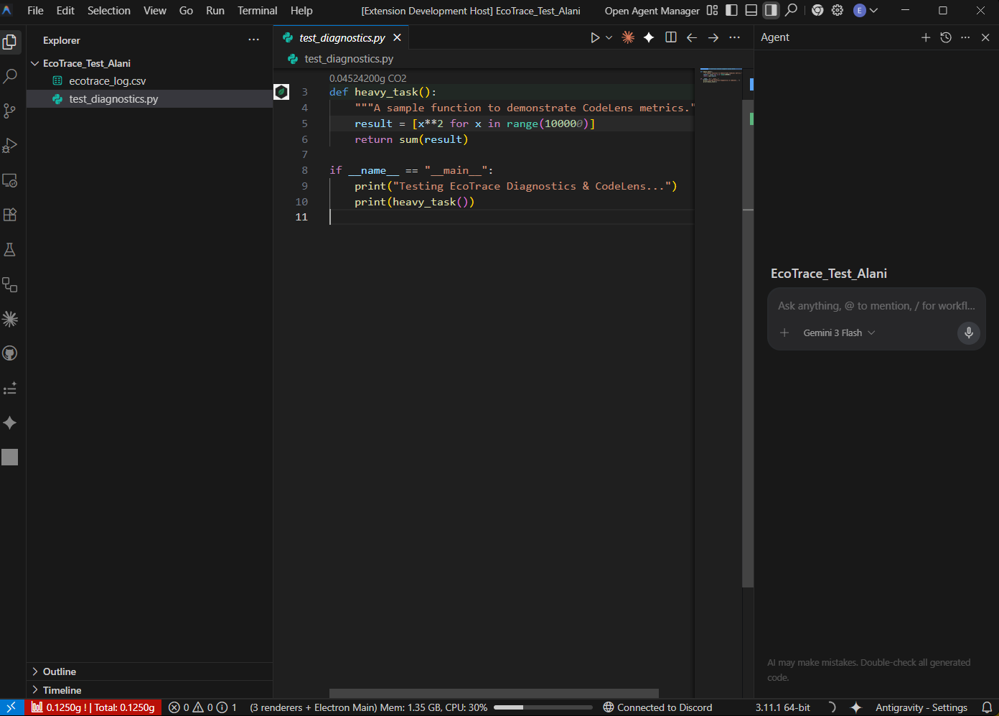

# EcoTrace — See the Carbon Cost of Every Function, Live in Your Editor.



EcoTrace brings real-time carbon footprint monitoring directly into VS Code. As you run your Python code, you see exactly how much CO₂ each function emitted — displayed above the function, in your status bar, and compiled into a full PDF report.

No dashboards. No context switching. Just your code, and its real environmental cost.

---

## Features

### Smart Code Suggestions *(No library required)*
EcoTrace statically analyzes your Python files and flags energy-inefficient patterns as you write — even without the Python library installed. For example, it detects `import json` and suggests switching to `ujson` or `orjson` for meaningfully lower CPU energy consumption.

These hints appear as inline diagnostics, the same way type errors or linting warnings do.

### Eco-Friendly Mode *(No library required)*
Activate via the Command Palette (`EcoTrace: Enable Eco-Friendly Mode`) to reduce background indexing and non-essential processing during active development sessions.

### Function-Level Carbon Metrics *(Requires library)*
Once the EcoTrace Python library is running in your project, carbon emissions appear directly above your functions via CodeLens — updated automatically on every run.

```python
# 0.0032g CO₂  ← appears here automatically
def process_data(df):
    ...
```

### Real-Time Status Bar
A lightweight status bar indicator shows your last function's carbon footprint and the running session total. Functions that exceed the warning threshold are highlighted in red.

```
$(graph) 0.0041g ! | Total: 0.0187g
```

### Session Carbon Budget *(Requires library)*
Set a cumulative carbon threshold for your session via workspace settings. EcoTrace monitors your total emissions and warns you when you cross the limit — useful for catching energy regressions before they reach CI/CD.

### Full PDF Report *(Requires library)*
Click the status bar item or run `EcoTrace: Open Full Report` to view a detailed breakdown of all measured functions, timestamps, and emissions for the current session.

---

## How It Works

EcoTrace is two components in one repository:

- **The VS Code Extension** — provides static analysis, visualizations, and real-time UI updates
- **The Python Library** — instruments your code at runtime and generates the carbon measurements the extension reads

The extension works standalone for static analysis features. For live metrics (CodeLens, Status Bar, PDF Report), the Python library needs to be running in your project. Without it, the extension will remain in *"Waiting for data..."* mode.

---

## Getting Started

### Step 1 — Install the Python library

```bash
pip install ecotrace
```

### Step 2 — Instrument your functions

```python
import ecotrace

@ecotrace.track
def my_function():
    # your code here
    ...
```

### Step 3 — Run your code

EcoTrace automatically detects the generated telemetry and visualizes it inside VS Code. No manual configuration needed.

---

## Configuration

| Setting | Description | Default |
|---|---|---|
| `ecotrace.carbonBudget` | Session carbon threshold (gCO₂) before warning | `10.0` |
| `ecotrace.ecoFriendlyMode` | Tracks the status of Eco-Friendly operational mode | `false` |

Settings are available via **File → Preferences → Settings → EcoTrace**.

---

## Commands

| Command | Description |
|---|---|
| `EcoTrace: Open Full Report` | Opens the PDF carbon report for the current session |
| `EcoTrace: Reset Session` | Resets the cumulative session carbon counter |
| `EcoTrace: Enable Eco-Friendly Mode` | Activates energy-saving operational mode |

---

## Requirements

- VS Code `1.80.0` or higher
- Python `3.8+` *(for live metrics)*
- `ecotrace` Python library — `pip install ecotrace` *(for live metrics)*

---

## Repository

Both the VS Code extension and the Python library live in the same repository.
If you'd like to contribute, report a bug, or explore the source, visit the project on GitHub.

---

*EcoTrace — Carbon observability for developers who care about what their code actually costs.*