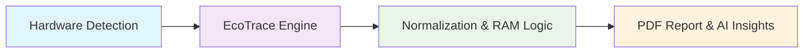

<div align="center">

# ⚡ EcoTrace

### High-Precision Carbon Tracking for Production Python

*Measure. Optimize. Report. — Function-level carbon intelligence with scientific rigor.*



*Figure 1: v0.5.0 Hardware Analysis & Normalization Pipeline*

## 🔥 v0.5.0 - The Hardware Intelligence Update

EcoTrace v0.5.0 represents a massive leap in carbon tracking accuracy and architectural modularity. We've evolved from simple monitoring to deep hardware-aware analysis scaling from 1 to 128+ CPU cores with scientific precision.

**Key Innovations:**
- **🧬 Smart Core Normalization:** Eliminates utilization spikes on multi-core systems
- **⚡ RAM Generation Awareness:** DDR4/DDR5 detection with MHz speed analysis  
- **🍎 Apple Silicon Support:** Full M1/M2/M3 architecture optimization
- **🤖 AI Insights Engine:** Automated optimization suggestions in PDF reports
- **⚙️ Deep Modularization:** Hardened architecture separating CPU, GPU, and RAM analysis into standalone intelligence modules 

> [!NOTE]
> v0.5.0 is now live and stable for production use!

## 🚀 Quick Start

```bash
pip install ecotrace
```

```python
from ecotrace import EcoTrace

# Initialize with hardware detection
eco = EcoTrace(region_code="TR")

# Function-level tracking
@eco.track
def my_function():
    return sum(i * i for i in range(10**6))

# Execute the function
my_function()

# Generate comprehensive report
eco.generate_pdf_report("my_report.pdf")
```

[](https://pypi.org/project/ecotrace/)
[](https://www.python.org/downloads/)
[](https://opensource.org/licenses/MIT)
[](https://github.com/Zwony/ecotrace)
[](https://pepy.tech/project/ecotrace)
[](https://pepy.tech/project/ecotrace)
[](https://github.com/Zwony/ecotrace/stargazers)

<br>
<br>

[](https://discord.gg/hs58XXb3Uq)

*🐛 Report bugs · 💡 Suggest features · 💻 Contribute TDP data · 🛠️ Get support*

<br>
<br>


</div>

---

## 🆚 EcoTrace vs CodeCarbon

| Feature | EcoTrace | CodeCarbon |
|---|---|---|
| CPU tracking | ✅ | ✅ |
| NVIDIA GPU tracking | ✅ | ✅ |
| **AMD + Intel GPU tracking** | ✅ | ❌ |
| **Async function support** | ✅ | ❌ |
| **Process-scoped CPU** (not system-wide) | ✅ | ❌ |
| **50ms continuous sampling** | ✅ | ❌ |
| **Side-by-side comparison** (`compare()`) | ✅ | ❌ |
| **PDF report with CPU charts** | ✅ | ❌ |
| **Thread-safe multi-decorator** | ✅ | ❌ |
| **1800+ CPU TDP database** (Boavizta) | ✅ | ❌ |
| **Crash-proof decorators** (result always returned) | ✅ | ❌ |
| 40+ region support | ✅ | Limited |
| CSV audit logging | ✅ | ✅ |
| Zero-config decorator | ✅ | ✅ |

---

## Why EcoTrace?

Modern software teams face increasing pressure to quantify and reduce their computational carbon footprint — from EU CSRD mandates to internal ESG commitments. Most carbon tracking tools bolt on heavy instrumentation that distorts the very workloads they measure.

**EcoTrace takes a different approach.**

<table>
<tr>
<td width="33%" valign="top">

### 🔬 Scientifically Grounded
TDP-based energy estimation powered by **Boavizta's crowdsourced database of 1,800+ CPU models**. Every measurement traces back to real hardware specs — not heuristics.

</td>
<td width="33%" valign="top">

### 🪶 Minimal Overhead
**50 ms daemon-thread sampling** with process-scoped isolation. Zero interference with your hot paths. Designed to run in production, not just in benchmarks.

</td>
<td width="33%" valign="top">

### 📋 Compliance-Ready
Per-function gCO₂ audit trail with timestamped CSV logs and PDF reports. Ready for **ESG reporting, GHG Protocol, and EU CSRD** documentation requirements.

</td>
</tr>
</table>

---

## Example Output

```python
# [EcoTrace] Function   : my_function
# [EcoTrace] Duration   : 0.0452 sec
# [EcoTrace] Avg CPU    : 23.4%
# [EcoTrace] CO2 Emitted: 0.00001823 gCO2
```

> **That's it.** One decorator. Real carbon data. No configuration files, no background services, no cloud dependencies.

---

## Core API

### `@eco.track` — CPU Carbon Measurement

Attach to any function — EcoTrace automatically detects whether it's synchronous or asynchronous and selects the optimal measurement strategy.

```python
# Synchronous — works out of the box
@eco.track
def train_model():
    # Your training logic
    pass

# Asynchronous — detected and handled automatically
@eco.track
async def fetch_data():
    await asyncio.sleep(1)
    return await api.get("/data")
```

**Under the hood:** A background daemon thread samples process-level CPU utilization every **50 ms** using `psutil.Process()`, ensuring measurements are scoped to *your* process — not polluted by system-wide activity.

---

### `@eco.track_gpu` — GPU-Aware Carbon Measurement

Supports **NVIDIA, AMD, and Intel GPUs** with real-time utilization sampling. Measures actual GPU load — never assumes full TDP draw.

```python
eco = EcoTrace(region_code="US", gpu_index=0)  # Select GPU by index

@eco.track_gpu
def gpu_inference():
    # CUDA / GPU workload
    pass

# [EcoTrace] GPU Carbon Emissions: 0.00012841 gCO2
# [EcoTrace] Duration     : 1.2400 sec
# [EcoTrace] GPU Usage    : 74.3%
```

**Graceful degradation:** If no GPU is detected or GPU drivers are unavailable, EcoTrace logs a notice and executes your function normally — **it never crashes your application.**

---

### `eco.compare()` — Side-by-Side Analysis

Compare two implementations to find the greener path:

```python
def bubble_sort(data):
    # O(n²) sorting
    ...

def quick_sort(data):
    # O(n log n) sorting
    ...

result = eco.compare(bubble_sort, quick_sort)
# [EcoTrace] Comparison Results:
# Function 1: bubble_sort  — 0.3821 sec — 0.00042917 gCO2
# Function 2: quick_sort   — 0.0089 sec — 0.00000998 gCO2
```

---

### `eco.generate_pdf_report()` — Audit-Ready Reports

Generate comprehensive PDF reports with system information, full function history, CPU usage charts, and cumulative emissions — ready for stakeholder review.

```python
result = await eco.measure_async(my_workload)
eco.generate_pdf_report(
    "quarterly_carbon_audit.pdf",
    comparison=comparison_data,
    cpu_samples=result.get("cpu_samples")
)
```

**Report includes:**
- Hardware profile (CPU model, TDP, cores, GPU, region)
- Timestamped function-by-function emission history
- CPU usage-over-time charts (matplotlib rendered)
- Side-by-side comparison tables
- Total cumulative CO₂ emissions

---

## The Science Behind EcoTrace

EcoTrace implements a **TDP-based energy estimation model**, the industry-standard approach for software-level carbon measurement.

### Energy Model

```
Energy (Wh) = TDP (W) × CPU Utilization (%) × Duration (s) / 3600
Carbon (gCO₂) = Energy (kWh) × Carbon Intensity (gCO₂/kWh)
```

| Component | Source | Detail |
|---|---|---|
| **TDP (Thermal Design Power)** | [Boavizta CPU Specs](https://github.com/Boavizta/cpu-spec) | Crowdsourced database of **1,800+ CPU models** with manufacturer-reported TDP values |
| **CPU Utilization** | `psutil.Process().cpu_percent()` | Process-scoped, **50 ms continuous sampling** via daemon threads — not point-in-time snapshots |
| **Duration** | `time.perf_counter()` | High-resolution monotonic clock, immune to NTP drift and wall-clock jumps |
| **Carbon Intensity** | IEA + regional grid data | **40 country/region grid emission factors**, updated from IEA 2022 global averages |

### Why 50 ms Continuous Sampling Matters

Most carbon trackers take a **single CPU reading** at the start and end of a function call. This misses the actual utilization profile — bursty workloads, GIL contention, and I/O waits are all invisible.

EcoTrace's **continuous 50 ms sampling** captures the real CPU utilization curve:

```
Traditional:  ──■─────────────────────■──  (2 data points)
EcoTrace:     ──■──■──■──■──■──■──■──■──  (N data points @ 50ms)
```

The result: **significantly more accurate energy estimation**, especially for workloads with variable CPU profiles.

---

## Robustness & Safety

EcoTrace is engineered to be **safe for production deployment**. It employs multiple layers of defensive design:

| Safety Feature | Implementation |
|---|---|
| **GPU Fallback Chain** | NVIDIA (`pynvml`) → AMD/Intel (`WMI`) → graceful `None` — never crashes |
| **Missing Driver Tolerance** | If GPU drivers aren't installed, `@track_gpu` executes the function normally and logs a notice |
| **Thread-Safe Sampling** | `threading.Lock` guards all sample buffers; `deque(maxlen=1000)` prevents memory leaks |
| **Process Isolation** | `psutil.Process()` scopes CPU measurement to the calling process — no cross-process noise |
| **TDP Fallback** | Unrecognized CPUs default to **65W** (mid-range desktop); GPUs use vendor-class estimates (Intel: 15W, AMD: 75W) |
| **Carbon Intensity Fallback** | Unknown regions default to **475 gCO₂/kWh** (IEA 2022 global average) |
| **Clean Shutdown** | `__del__` and daemon threads ensure monitoring stops even on unexpected exits |

---

## Hardware & Region Coverage

### Supported CPUs

EcoTrace auto-detects your CPU and resolves its TDP from the **Boavizta crowdsourced database**:

| Vendor | Families |
|---|---|
| **Intel** | Core i3 / i5 / i7 / i9 (all generations), Xeon, Atom |
| **AMD** | Ryzen 3 / 5 / 7 / 9, Threadripper, EPYC |
| **Apple** | M1, M2, M3 series |

### Supported GPUs

| Vendor | Detection Method | TDP Source |
|---|---|---|
| **NVIDIA** | `pynvml` (NVML) | Driver-reported power management limit |
| **AMD** | WMI (Windows) | Vendor-class estimate (75W) |
| **Intel** | WMI (Windows) | Vendor-class estimate (15W) |

### Supported Regions (40+)

<details>
<summary><strong>Click to expand full region table</strong></summary>

| Code | Country | gCO₂/kWh | | Code | Country | gCO₂/kWh |
|------|---------|----------:|-|------|---------|----------:|
| SE | Sweden | 13 | | CH | Switzerland | 25 |
| NO | Norway | 26 | | FR | France | 55 |
| FI | Finland | 65 | | BR | Brazil | 74 |
| NZ | New Zealand | 120 | | CA | Canada | 130 |
| AT | Austria | 158 | | DK | Denmark | 166 |
| BE | Belgium | 167 | | PT | Portugal | 176 |
| ES | Spain | 187 | | HU | Hungary | 223 |
| IT | Italy | 233 | | GB | United Kingdom | 253 |
| NL | Netherlands | 290 | | RO | Romania | 293 |
| AR | Argentina | 314 | | DE | Germany | 385 |
| NG | Nigeria | 385 | | SG | Singapore | 408 |
| CZ | Czech Republic | 412 | | KR | South Korea | 415 |
| EG | Egypt | 448 | | JP | Japan | 463 |
| TR | Turkey | 475 | | AU | Australia | 490 |
| TH | Thailand | 513 | | MX | Mexico | 527 |
| CN | China | 555 | | PH | Philippines | 558 |
| MY | Malaysia | 585 | | PL | Poland | 635 |
| IN | India | 708 | | ID | Indonesia | 761 |
| ZA | South Africa | 928 | | US | United States | 367 |

</details>

---

## How EcoTrace Compares

| Feature | **EcoTrace** | CodeCarbon | CarbonTracker |
|---|:---:|:---:|:---:|
| **Decorator-based API** | ✅ One-line `@track` | ❌ Context manager only | ❌ Manual start/stop |
| **Function-level granularity** | ✅ Per-function | ⚠️ Session-level | ⚠️ Epoch-level |
| **Async-native support** | ✅ Auto-detected | ❌ | ❌ |
| **50 ms continuous sampling** | ✅ Daemon threads | ❌ Point-in-time | ❌ Point-in-time |
| **GPU monitoring** | ✅ NVIDIA + AMD + Intel | ✅ NVIDIA only | ✅ NVIDIA only |
| **Process isolation** | ✅ `psutil.Process()` | ❌ System-wide | ❌ System-wide |
| **PDF audit reports** | ✅ Built-in | ❌ | ❌ |
| **CPU usage charts** | ✅ Matplotlib | ❌ | ❌ |
| **Function comparison** | ✅ `eco.compare()` | ❌ | ❌ |
| **CPU TDP database** | ✅ 1,800+ models | ✅ ~1,000 models | ❌ Manual config |
| **Zero-config setup** | ✅ Auto-detection | ⚠️ Config required | ⚠️ Config required |
| **Graceful GPU fallback** | ✅ Never crashes | ❌ Raises exceptions | ❌ Raises exceptions |

---

## Roadmap — EcoTrace Pro Ecosystem

EcoTrace is building toward a **complete sustainability intelligence platform**. Here's what's on the horizon:

| Phase | Feature | Status |
|---|---|---|
| **v1.x** | ☁️ Cloud Dashboard — Real-time emissions visualization | 🔜 In Design |
| **v1.x** | 🔗 AWS / Azure / GCP Native Monitoring — Cloud resource carbon attribution | 🔜 Planned |
| **v2.0** | 📊 Automated ESG Report Generation — CSRD and GHG Protocol-compliant exports | 🔜 Planned |
| **v2.0** | 🏢 Team & Organization Carbon Budgets — Multi-project rollup with alerting | 🔜 Planned |
| **v2.x** | 🔌 CI/CD Pipeline Integration — GitHub Actions / GitLab CI carbon gates | 🔜 Planned |
| **v2.x** | 📡 Real-Time Grid Carbon API — Dynamic emission factors based on live grid mix | 🔜 Research |

> **Interested in EcoTrace Pro?** [Open an issue](https://github.com/Zwony/ecotrace/issues) or join the discussion on Discord to shape the roadmap.

---

## Dependencies

```
psutil          — Process-level CPU monitoring
py-cpuinfo      — Hardware identification
fpdf            — PDF report generation
matplotlib      — CPU usage charting
nvidia-ml-py    — NVIDIA GPU monitoring (optional at runtime)
wmi             — AMD/Intel GPU detection (Windows only)
```

> **Compatibility:** EcoTrace is tested on Python 3.7+ and runs on Windows, macOS, and Linux. GPU features require appropriate vendor drivers.

---

## Contributing

We welcome contributions from the community. Please see [CONTRIBUTING.MD](CONTRIBUTING.MD) for guidelines on how to get involved.

---

## Author

**Emre Özkal** — [emreozkal03@gmail.com](mailto:emreozkal03@gmail.com)

---

## License

MIT License — use it however you like.

---

<div align="center">

*Built with 💚 for a sustainable software future.*

**[Documentation](https://github.com/Zwony/ecotrace)** · **[PyPI](https://pypi.org/project/ecotrace/)** · **[Discord](https://discord.gg/hs58XXb3Uq)** · **[Issues](https://github.com/Zwony/ecotrace/issues)**

</div>