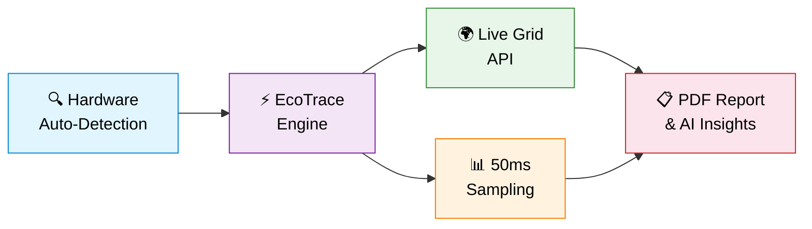
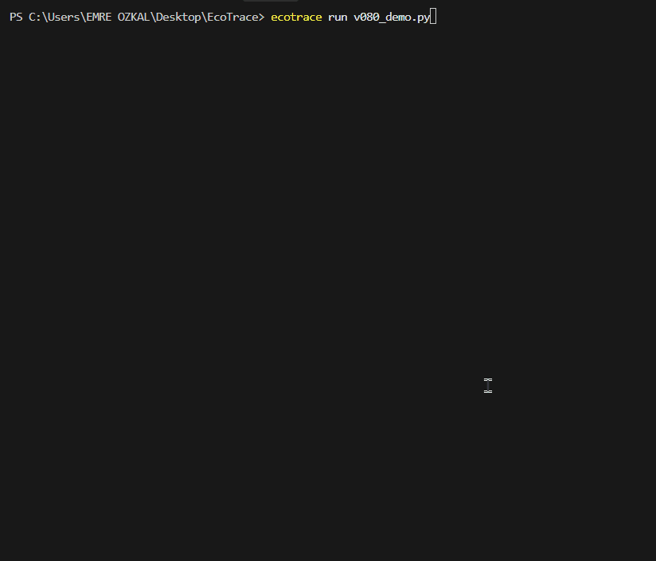
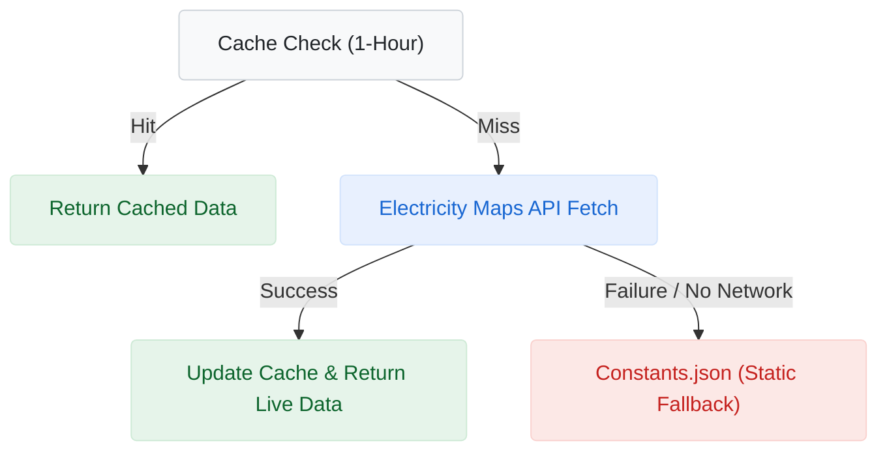
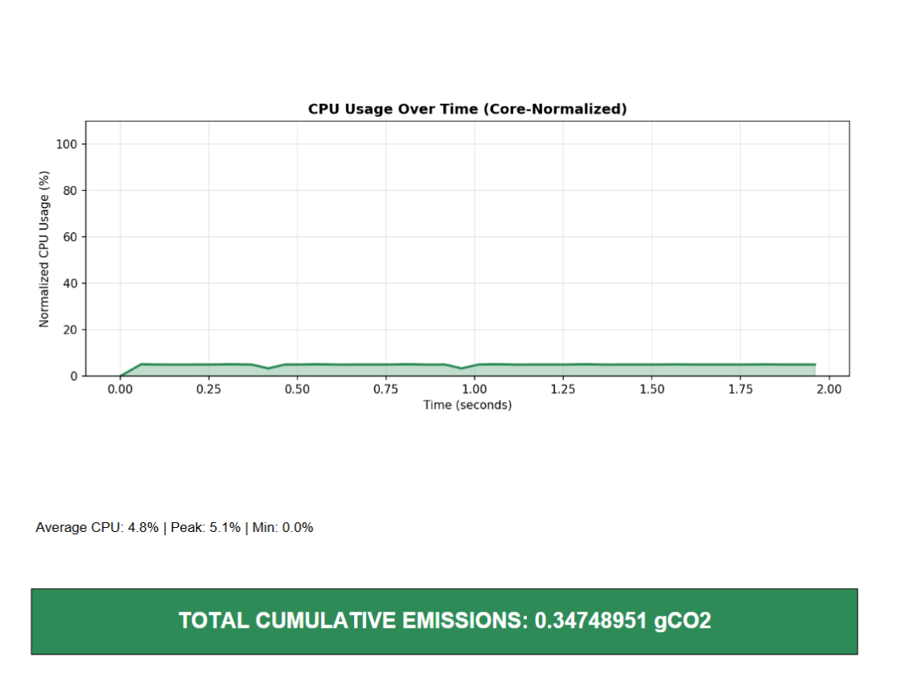
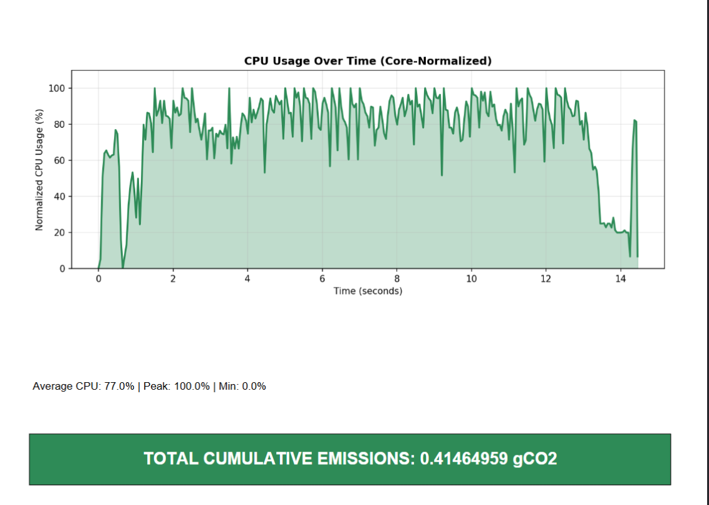
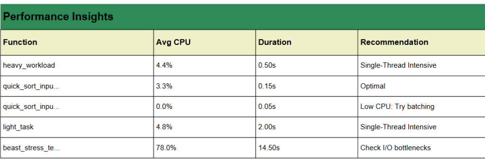
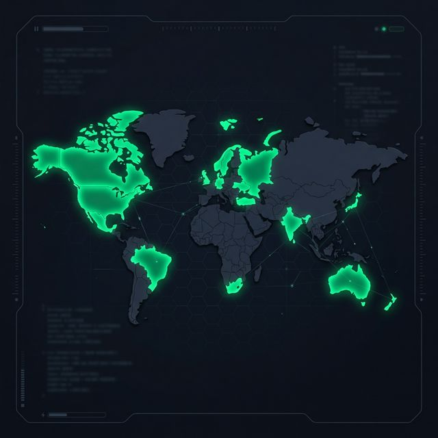

<div align="center">

# EcoTrace — Sustainability Engine for Python

### High-precision carbon tracking for production systems
**EcoTrace is a continuous instrumentation engine designed for engineers who require accurate hardware specifications and process-isolated metrics.**

*Real-time carbon tracking · Global Grid Coverage · Hardware Intelligence · Zero-config Deployment*

<br>

[](https://pypi.org/project/ecotrace/)
[](https://www.python.org/downloads/)
[](https://opensource.org/licenses/MIT)
[](https://pepy.tech/project/ecotrace)
[](https://github.com/Zwony/ecotrace/stargazers)
[](https://marketplace.visualstudio.com/items?itemName=ecotrace-team.ecotrace-monitor)
[)](https://marketplace.visualstudio.com/items?itemName=ecotrace-team.ecotrace-monitor)

<br>

> [!TIP]
> **🚀 VS Code User?** Monitor your code's carbon footprint in real-time as you write! [Download the EcoTrace VS Code extension](https://marketplace.visualstudio.com/items?itemName=ecotrace-team.ecotrace-monitor).

<br>

<br>

[](https://github.com/Zwony/ecotrace)
[](https://www.electricitymaps.com/)
[](https://github.com/Zwony/ecotrace)
[](https://github.com/Boavizta/cpu-spec)
[](https://pypi.org/project/ecotrace/)

<br>

[](https://discord.gg/hs58XXb3Uq)

*🐛 Report bugs · 💡 Suggest features · 💻 Contribute TDP data · 🛠️ Get support*

> [!IMPORTANT]
> **EcoTrace v0.7.0 — The Ecosystem Update**
> 
> EcoTrace is evolving from a local utility into a comprehensive observability platform. This update introduces specialized tools for architecture-wide carbon monitoring:
> - **Pytest Integration:** Automated energy cost analysis for test suites with hotspot identification.
> - **Web Middleware:** Plug-and-play extensions for FastAPI, Starlette, and Flask with request-level tracking and header injection.
> - **Production Readiness:** Hardened codebase with enhanced error recovery and standardized hardware normalization.

<br>



*EcoTrace v0.6.1 — Sustainability OS Pipeline*

<br>



*EcoTrace in Action — Function-level carbon measurement with real-time monitoring*

</div>

---

We didn't just build a wrapper; we built a **Continuous Measurement Engine**. By sampling at 50ms intervals and isolating your process from the OS noise, we provide an audit-ready trace anchored in verified hardware specifications. Because at the end of the day, you can't optimize what you can't measure with precision.

---

## ⚡ Quick Install

```bash
pip install ecotrace
```

---

## 🚀 Get Started in 60 Seconds


```python
from ecotrace import EcoTrace

# Initialize — hardware auto-detected, live grid data fetched
eco = EcoTrace(region_code="TR")

# One decorator. Real carbon data. That's it.
@eco.track
def train_model():
    return sum(i * i for i in range(10**6))

train_model()

# Generate audit-ready PDF report
eco.generate_pdf_report("carbon_audit.pdf")
```

```
--- EcoTrace v0.6.1 Initialized ---
Region  : TR (482 gCO2/kWh 🟢 LIVE)
CPU     : 13th Gen Intel Core i7-13700H
Cores   : 20
TDP     : 45.0W
RAM     : 15.6 GB DDR4 @ 3200MHz
GPU     : Intel Iris Xe Graphics
---------------------------------
```

> **One decorator. Real carbon data. No configuration files, no background services, no cloud dependencies.**

---

## 🆕 What's New in v0.6.1 — Sustainability OS

EcoTrace v0.6.1 transforms from a measurement tool into a **Sustainability Operating System** with two game-changing features:

<table>
<tr>
<td width="50%" valign="top">

### 🌍 Live Grid API Integration

Real-time carbon intensity data from **Electricity Maps API** replaces static regional constants. Your measurements now reflect the *actual* grid mix at the moment of execution.

- **38 country zones** with automatic mapping
- **1-hour intelligent caching** (respects API limits)
- **Zero-impact fallback**: No API key? No internet? Static data kicks in silently

```python
eco = EcoTrace(
    region_code="TR",
    grid_api_key="YOUR_KEY"
)
# Region: TR (482 gCO2/kWh 🟢 LIVE)
```

</td>
<td width="50%" valign="top">

### 🌱 Auto-Update System

EcoTrace now checks for updates automatically at startup and asks politely:

```
[EcoTrace] 🌱 A new version is available! (v0.5.2 → v0.6.1)
[EcoTrace] Would you like to update? (y/n):
```

- **Non-blocking**: 3-second timeout, never delays your app
- **Interactive**: `y` upgrades via pip, `n` skips
- **CI/CD safe**: Disable with `check_updates=False`
- **PEP 440 compliant** semantic version comparison

</td>
</tr>
</table>

---

## 💡 Why EcoTrace?

Modern software teams face increasing pressure to quantify their carbon footprint — from **EU CSRD mandates** to internal ESG commitments. Most carbon tools bolt on heavy instrumentation that distorts the workloads they measure.

**EcoTrace takes a fundamentally different approach.**

<table>
<tr>
<td width="33%" valign="top">

### 🔬 Scientifically Grounded
TDP-based energy estimation powered by **Boavizta's database of 1,800+ CPU models**. Every measurement traces back to verified manufacturer specifications — eliminating broad category-level guesswork.

</td>
<td width="33%" valign="top">

### 🪶 Minimal Overhead
**50 ms daemon-thread sampling** with process-scoped isolation. Zero interference with your hot paths. Designed for production, not just benchmarks.

</td>
<td width="33%" valign="top">

### 📋 Compliance-Ready
Per-function gCO₂ audit trail with timestamped CSV logs and PDF reports. Ready for **ESG, GHG Protocol, and EU CSRD** documentation.

</td>
</tr>
</table>

---

## 🆚 How EcoTrace Compares

| Feature | **EcoTrace v0.7.0** | Industry Alternatives |
|---|:---:|:---:|
| **Instrumentation** | One-line `@track` decorator | Manual sessions |
| **Granularity** | **50ms** Continuous Sampling | 15s - 30s intervals |
| **Process Isolation** | `psutil` Process-Scoped | System-wide (includes OS noise) |
| **Grid Accuracy** | Live Electricity Maps API | Static averages |
| **Hardware Data** | 1,800+ CPU Models (Boavizta) | Generic TDP categories |
| **Reporting** | Audit-ready PDF & AI Insights | CSV only |

> [!NOTE]
> **Carbon Metrics Disclaimer:** Carbon intensity and energy estimation are evolving fields. EcoTrace provides high-fidelity estimations based on manufacturer TDP and live grid data, which should be used for relative optimization and internal auditing. For regulatory compliance, cross-reference with direct hardware power meters where available.

### 🎯 Key Differentiators

*   **System Noise Filtration (Process Isolation):** Tools that rely on system-wide RAPL sensors capture background OS noise (Windows updates, browsers, etc.). EcoTrace isolates down to the exact `psutil.Process()` and its children, providing a calculated footprint isolated to your code's specific execution.
*   **True Function-Level Granularity:** CodeCarbon defaults to 15-second tracking intervals, and CarbonTracker measures per heavy ML epoch. EcoTrace's **continuous 50ms micro-sampling** allows it to accurately track bursty web server requests, async I/O waits, and GIL contention that other tools completely miss.
*   **Fail-Safe Architecture:** Carbon tools are for observability—they should never crash your product. While missing permissions, VMs, or missing hardware drivers cause other trackers to throw fatal execution-halting exceptions, EcoTrace gracefully falls back to static rule-based estimations and guarantees your application keeps running.
*   **Actionable AI Assistant:** Instead of just outputting a CSV file and leaving you guessing, EcoTrace directly feeds the metrics to Google Gemini. It acts as a Green-Coding Assistant, offering hardware-specific optimization advice (e.g., *"Switch this 12-second CPU-bound loop to a vectorized NumPy array to save 15% energy"*).

---

## 📦 Core API

### `@eco.track` — CPU Carbon Measurement

```python
# Synchronous — works out of the box
@eco.track
def train_model():
    pass

# Asynchronous — detected and handled automatically
@eco.track
async def fetch_data():
    await asyncio.sleep(1)
    return await api.get("/data")
```

**Under the hood:** A background daemon thread samples process-level CPU utilization every **50 ms**, ensuring measurements are scoped to *your* process — not polluted by system-wide activity.

---

### `@eco.track_gpu` — GPU-Aware Carbon Measurement

Supports **NVIDIA, AMD, and Intel GPUs** with real-time utilization sampling:

```python
eco = EcoTrace(region_code="US", gpu_index=0)

@eco.track_gpu
def gpu_inference():
    # CUDA / GPU workload
    pass

# [EcoTrace] GPU Carbon Emissions: 0.00012841 gCO2
# [EcoTrace] Duration     : 1.2400 sec
# [EcoTrace] GPU Usage    : 74.3%
```

**Graceful degradation:** No GPU detected? Function executes normally. Drivers missing? A notice is logged. **It never crashes your application.**

---

### `eco.compare()` — Side-by-Side Analysis

```python
def bubble_sort(data):
    ...  # O(n²)

def quick_sort(data):
    ...  # O(n log n)

result = eco.compare(bubble_sort, quick_sort)
# [EcoTrace] Comparison Results:
# Function 1: bubble_sort  — 0.3821 sec — 0.00042917 gCO2
# Function 2: quick_sort   — 0.0089 sec — 0.00000998 gCO2
```

---

### `eco.track_block()` — Context Manager Tracking

```python
with eco.track_block("data_pipeline"):
    df = load_data()
    df = transform(df)
    save_results(df)

# [EcoTrace] Block 'data_pipeline': 2.341s, 45.2% CPU, 0.000234g CO2
```

---

### `eco.generate_pdf_report()` — Audit-Ready Reports

```python
eco.generate_pdf_report("quarterly_carbon_audit.pdf")
```

**Report includes:**
- 🖥️ Hardware profile (CPU model, TDP, cores, GPU, region)
- 📊 CPU & GPU usage-over-time charts (matplotlib rendered)
- 📋 Timestamped function-by-function emission history
- 🆚 Side-by-side comparison tables
- 🤖 AI-powered optimization insights (with Gemini API key)
- 📈 Total cumulative CO₂ emissions

---

## 🌍 Live Grid API — Electricity Maps Integration

EcoTrace v0.6.1 fetches **real-time carbon intensity** from the Electricity Maps API, replacing static constants with live grid data:




```python
# Option 1: Pass key directly
eco = EcoTrace(region_code="DE", grid_api_key="YOUR_KEY")

# Option 2: Environment variable
# export ECOTRACE_GRID_API_KEY="YOUR_KEY"
eco = EcoTrace(region_code="DE")

# Output:
# [EcoTrace] 🌍 Live grid data: 312 gCO2/kWh
# Region: DE (312 gCO2/kWh 🟢 LIVE)
```

> **No API key?** EcoTrace works perfectly with static data. Live grid is an opt-in upgrade for scientific precision.

---

## 🤖 Gemini AI Insights — Green Coding Assistant

EcoTrace integrates **Google Gemini AI** to transform raw metrics into actionable optimization advice:

```python
eco = EcoTrace(api_key="YOUR_GEMINI_API_KEY")
# Or: export GEMINI_API_KEY="YOUR_KEY"

eco.generate_pdf_report("smart_audit.pdf")
```

**AI-Powered Insights include:**
- **Vectorization:** "Your i7-13700H supports AVX-512; use NumPy for this loop to save 15% energy."
- **Architecture Tuning:** "This function is I/O bound; switching to `asyncio` could reduce idle CPU carbon by 20%."
- **Library Swaps:** "Consider `lxml` instead of `xml.etree` for this workload to improve efficiency."

> **Opt-in Feature:** Only activated when a valid `GEMINI_API_KEY` is provided. No key? EcoTrace operates with full local monitoring and rule-based insights.

---

## 📊 Concrete Evidence: EcoTrace in Action

To demonstrate EcoTrace's low overhead and high precision capabilities across different workload spectrums, we ran both minimal and maximum stress tests, alongside Gemini AI's actionable insights.

### 🍃 1. Lightweight Workload (Single-Thread Intensive)
We ran a simple, single-threaded mathematical task (`lightweight_test_v5.py`) to show how EcoTrace gently handles micro-measurements entirely in daemon threads without polluting the main process.

- **Function Name:** `light_task`
- **Execution Time:** `2.00 s`
- **CPU Utilization:** `4.8%` (Process-isolated average)
- **Carbon Footprint:** `0.000574 gCO₂`



### 🔥 2. Heavyweight Workload (Global Multi-Core Saturation)
We ran the "Beast" stress test (`beast_stress_test.py`), pushing all 20 cores of an `i7-13700H` processor to their absolute limits. This proves that the core normalization engine correctly scales usage percentages to 100% capacity and maintains system stability under extreme stress.

- **Function Name:** `beast_stress_test`
- **Execution Time:** `14.50 s`
- **CPU Utilization:** `77.0%` (Average sustained global multi-core saturation)
- **Carbon Footprint:** `0.414649 gCO₂`



### 💡 3. AI Performance Insights (Öneriler)
Using the built-in Gemini AI integration, EcoTrace analyzes these metrics and provides actionable green-coding recommendations, dynamically detecting anomalies like single-thread bottlenecks or over-utilized loops.



---

## 🔬 The Science Behind EcoTrace

EcoTrace implements a **TDP-based energy estimation model**, the industry-standard approach for software-level carbon measurement:

```
Energy (Wh) = TDP (W) × CPU Utilization (%) × Duration (s) / 3600
Carbon (gCO₂) = Energy (kWh) × Carbon Intensity (gCO₂/kWh)
```

| Component | Source | Detail |
|---|---|---|
| **TDP** | [Boavizta CPU Specs](https://github.com/Boavizta/cpu-spec) | **1,800+ CPU models** with manufacturer-reported TDP values |
| **CPU Utilization** | `psutil.Process().cpu_percent()` | Process-scoped, **50 ms continuous sampling** via daemon threads |
| **Duration** | `time.perf_counter()` | High-resolution monotonic clock, immune to NTP drift |
| **Carbon Intensity** | Electricity Maps API + IEA | **38 countries** with live or static grid emission factors |

### Why 50 ms Continuous Sampling?

Most carbon trackers take a **single CPU reading** at the start and end. They miss bursty workloads, GIL contention, and I/O waits entirely.

```
Traditional:  ──■─────────────────────■──  (2 data points)
EcoTrace:     ──■──■──■──■──■──■──■──■──  (N data points @ 50ms)
```

**Result:** Significantly more accurate energy estimation, especially for variable CPU profiles.

---

## 🧪 Engineering Excellence & Robustness

EcoTrace is engineered for **enterprise-grade production deployment** with a focus on precision, safety, and zero-impact monitoring:

| Strategy | Technical Implementation |
|---|---|
| **Smart Core Normalization** | Automatically scales multi-core CPU usage (e.g., 800% on 8 cores) down to a normalized **0-100% range** for intuitive analysis. |
| **Process Tree Intelligence** | Uses recursive process tracking to capture carbon/RAM from all **child processes** in complex multi-processing applications. |
| **Crash-Proof Diagnostics** | Replaces silent fail blocks with **descriptive error logging**. If measurement fails, the result is still returned, but the *reason* is clearly logged. |
| **Idle Baseline Subtraction** | Conducts a **100ms system baseline measurement** to subtract background noise, reporting only your code's incremental carbon footprint. |
| **Universal Async Support** | Zero-config `@track` decorator automatically detects and handles **asyncio** coroutines vs synchronous functions. |
| **GPU Fallback Chain** | NVIDIA (`pynvml`) → AMD/Intel (`WMI`) → graceful `None`. Measurement never crashes your app if drivers are missing. |
| **Thread-Safe Sampling** | All buffers are protected by `threading.Lock` and `deque(maxlen)` to prevent memory leaks and race conditions during high-frequency sampling. |

---

## 🗺️ Global Coverage — 50+ Countries

EcoTrace supports **50+ countries** with both static carbon intensity values and live Electricity Maps zone mappings:



<details>
<summary><strong>Click to expand full region table</strong></summary>

| Code | Country | gCO₂/kWh | | Code | Country | gCO₂/kWh |
|------|---------|----------:|-|------|---------|----------:|
| SE | Sweden | 13 | | CH | Switzerland | 25 |
| NO | Norway | 26 | | FR | France | 55 |
| FI | Finland | 65 | | BR | Brazil | 74 |
| NZ | New Zealand | 120 | | CA | Canada | 130 |
| AT | Austria | 158 | | DK | Denmark | 166 |
| BE | Belgium | 167 | | PT | Portugal | 176 |
| ES | Spain | 187 | | HU | Hungary | 223 |
| IT | Italy | 233 | | GB | United Kingdom | 253 |
| NL | Netherlands | 290 | | RO | Romania | 293 |
| AR | Argentina | 314 | | US | United States | 367 |
| DE | Germany | 385 | | NG | Nigeria | 385 |
| SG | Singapore | 408 | | CZ | Czech Republic | 412 |
| KR | South Korea | 415 | | EG | Egypt | 448 |
| JP | Japan | 463 | | TR | Turkey | 475 |
| AU | Australia | 490 | | TH | Thailand | 513 |
| MX | Mexico | 527 | | CN | China | 555 |
| PH | Philippines | 558 | | MY | Malaysia | 585 |
| PL | Poland | 635 | | IN | India | 708 |
| ID | Indonesia | 761 | | ZA | South Africa | 928 |
| KE | Kenya | 110 | | UA | Ukraine | 150 |
| CO | Colombia | 155 | | IE | Ireland | 275 |
| CL | Chile | 300 | | GR | Greece | 300 |
| AE | United Arab Emirates | 385 | | IL | Israel | 400 |
| TW | Taiwan | 494 | | GLOBAL | Worldwide Average | 475 |

*Static values from IEA 2024 global averages. With Live Grid API enabled, values update in real-time.*

</details>

### Supported Hardware

<table>
<tr>
<td width="33%" valign="top">

**🖥️ CPU**
| Vendor | Families |
|---|---|
| Intel | Core i3/i5/i7/i9, Xeon, Atom |
| AMD | Ryzen 3/5/7/9, Threadripper, EPYC |
| Apple | M1, M2, M3, M4 series |

</td>
<td width="33%" valign="top">

**🎮 GPU**
| Vendor | Method |
|---|---|
| NVIDIA | `pynvml` (NVML) |
| AMD | WMI (Windows) |
| Intel | WMI (Windows) |

</td>
<td width="33%" valign="top">

**🧠 RAM**
| Type | Watt Factor |
|---|---|
| DDR4 | 0.375 W/GB |
| DDR5 | 0.285 W/GB |
| *Auto-detected via clock speed* |

</td>
</tr>
</table>

---

## Release Roadmap

EcoTrace is developing into a comprehensive sustainability intelligence platform.

| Version | Feature | Status |
|---|---|---|
| **v0.7.0** | **VS Code Extension** | Released |
| **v0.7.0** | **Pytest Plugin** | Release Candidate |
| **v0.7.0** | **Web Middleware** | Release Candidate |
| **v0.7.x** | **CI/CD Carbon Gates** | Scheduled |
| **v0.7.x** | **Cloud Resource Mapping** | Scheduled |
| **v0.8.0** | **Enterprise Carbon Budgets** | Research Phase |

> **Note on Metrics:** EcoTrace provides estimates based on TDP and utilization. These figures are intended for optimization guidance and comparative analysis, not for formal regulatory carbon reporting.

---

## 📦 Dependencies

```
psutil              — Process-level CPU & RAM monitoring
py-cpuinfo          — Hardware identification & CPU detection
fpdf                — PDF report generation
matplotlib          — CPU/GPU usage charting
nvidia-ml-py        — NVIDIA GPU monitoring (optional at runtime)
google-generativeai — Gemini AI Insights engine (optional)
requests            — Live Grid API communication (Electricity Maps)
packaging           — PEP 440 semantic version comparison
wmi                 — AMD/Intel GPU detection (Windows only)
```

> **Compatibility:** EcoTrace is tested on Python 3.9+ and runs on Windows, macOS, and Linux. GPU features require appropriate vendor drivers.

---

## 🤝 Contributing

We welcome contributions from the community! See [CONTRIBUTING.MD](CONTRIBUTING.MD) for guidelines.

**Ways to contribute:**
- 🐛 Report bugs and issues
- 💡 Suggest new features
- 💻 Submit TDP data for unlisted CPUs
- 📝 Improve documentation
- 🌍 Add region/country support

---

## 👤 Author

**Emre Özkal** — [ecotraceteam@gmail.com](mailto:ecotraceteam@gmail.com)

---

## 📄 License

MIT License — use it however you like.

---

<div align="center">

*Built with 💚 for a sustainable software future.*

**[Documentation](https://github.com/Zwony/ecotrace)** · **[PyPI](https://pypi.org/project/ecotrace/)** · **[Discord](https://discord.gg/hs58XXb3Uq)** · **[Issues](https://github.com/Zwony/ecotrace/issues)**

</div>
