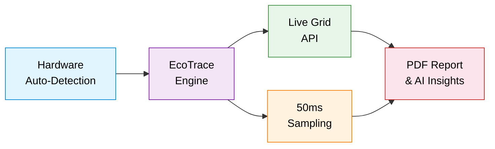
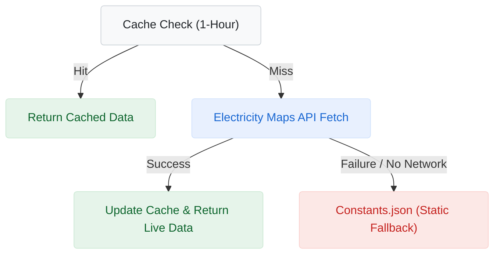

<div align="center">

# EcoTrace — Carbon Measurement for Python

### High-Precision Energy & Emissions Instrumentation

**EcoTrace is a lightweight instrumentation library designed for granular carbon footprint measurement of Python applications. It utilizes validated hardware specifications to provide high-fidelity reporting at the function level.**

*Real-time monitoring · 50+ Global Zones · AI-powered insights · Zero-configuration deployment*

<br>

[](https://pypi.org/project/ecotrace/)
[](https://www.python.org/downloads/)
[](https://opensource.org/licenses/MIT)
[](https://pepy.tech/project/ecotrace)
[](https://github.com/Zwony/ecotrace/stargazers)
[](https://github.com/Zwony/ecotrace/pulls)
[](https://github.com/Zwony/ecotrace/actions)
[](https://marketplace.visualstudio.com/items?itemName=ecotrace-team.ecotrace-monitor)
[)](https://marketplace.visualstudio.com/items?itemName=ecotrace-team.ecotrace-monitor)

<br>

> [!TIP]
> **VS Code Extension:** Monitor application carbon footprint in real-time during development. [Download the EcoTrace VS Code extension](https://marketplace.visualstudio.com/items?itemName=ecotrace-team.ecotrace-monitor).

<br>

[](https://github.com/Zwony/ecotrace)
[](https://www.electricitymaps.com/)
[](https://github.com/Zwony/ecotrace)
[](https://github.com/Boavizta/cpu-spec)
[](https://pypi.org/project/ecotrace/)

<br>

[](https://discord.gg/hs58XXb3Uq)

*Report bugs · Suggest features · Contribute TDP data · Get support*

<br>



*EcoTrace v0.7.1 — Measurement Pipeline*

<br>


*Function-level carbon measurement with real-time monitoring*

</div>

---

EcoTrace samples CPU utilization at 50ms intervals, isolating your process from OS-level noise and anchoring every measurement in verified manufacturer TDP specifications. The result is an audit-ready carbon trace you can act on.

---

## Quick Install

```bash
pip install ecotrace
```

---

## Get Started in 60 Seconds

```python
from ecotrace import EcoTrace

# Initialize — hardware auto-detected, live grid data fetched
eco = EcoTrace(region_code="TR")

# One decorator. Real carbon data.
@eco.track
def train_model():
    return sum(i * i for i in range(10**6))

train_model()

# Generate audit-ready PDF report
eco.generate_pdf_report("carbon_audit.pdf")
```

```
--- EcoTrace v0.7.1 Initialized ---
Region  : TR (482 gCO2/kWh LIVE)
CPU     : 13th Gen Intel Core i7-13700H
Cores   : 20
TDP     : 45.0W
RAM     : 15.6 GB DDR4 @ 3200MHz
GPU     : Intel Iris Xe Graphics
---------------------------------
```

> **Automated hardware detection and live grid transparency. No configuration files or background services required.**

---

## EcoTrace Core v0.7.1 — IDE Intelligence & Real-time Monitoring

For a complete history of changes and version releases, see [CHANGELOG.md](CHANGELOG.md).

EcoTrace v0.7.0 represents the most mature and stable state of the core instrumentation engine to date. This release focuses on high-resolution precision and production-scale reliability. While the core continues to evolve, future expansion will increasingly focus on the broader EcoTrace Ecosystem through modular extensions.

<table>
<tr>
<td width="50%" valign="top">

### Live Grid API Integration

Real-time carbon intensity data from **Electricity Maps API** replaces static regional constants. Your measurements now reflect the *actual* grid mix at the moment of execution.

- **38 country zones** with automatic mapping
- **1-hour intelligent caching** (respects API limits)
- **Silent fallback**: In the absence of an API key or network connectivity, EcoTrace utilizes internal static emission factors.

```python
eco = EcoTrace(
    region_code="TR",
    grid_api_key="YOUR_KEY"
)
# Region: TR (482 gCO2/kWh LIVE)
```

</td>
<td width="50%" valign="top">

### Auto-Update System

EcoTrace checks for updates automatically at startup and prompts the user:

```
[EcoTrace] A new version is available! (v0.7.1 → v0.7.2)
[EcoTrace] Would you like to update? (y/n):
```

- **Non-blocking**: 3-second timeout, never delays your app
- **Interactive**: `y` upgrades via pip, `n` skips
- **CI/CD safe**: Disable with `check_updates=False`
- **PEP 440 compliant** semantic version comparison

</td>
</tr>
</table>

---

## Why EcoTrace?

Modern software teams face increasing pressure to quantify their carbon footprint — from **EU CSRD mandates** to internal ESG commitments. Most carbon tools rely on system-wide sensors that capture background OS noise, and measure at coarse intervals that miss bursty or async workloads.

**EcoTrace addresses this with process-scoped isolation and continuous 50ms sampling**, providing measurements that trace back to verified hardware specifications rather than broad category-level estimates.

<table>
<tr>
<td width="33%" valign="top">

### Scientific Foundation
TDP-based energy estimation powered by the Boavizta database of 1,800+ CPU models. All measurements are derived from verified manufacturer specifications.

</td>
<td width="33%" valign="top">

### Operational Performance
50ms daemon-thread sampling with process-scoped isolation. Negligible overhead for production environments.

</td>
<td width="33%" valign="top">

### Regulatory Alignment
Per-function gCO₂ audit trails with timestamped logs and PDF reports. Compatible with ESG, GHG Protocol, and EU CSRD reporting standards.

</td>
</tr>
</table>

---

## How EcoTrace Compares

> **Note:** This comparison reflects the feature sets as of the versions tested. CodeCarbon and CarbonTracker are mature, well-adopted tools with different design goals — CodeCarbon is particularly strong for ML experiment tracking at scale.

| **Feature** | **EcoTrace v0.7.1** | CodeCarbon | CarbonTracker |
|---|:---:|:---:|:---:|
| **API Style** | ✅ One-line `@track` decorator | ✅ Decorator + Context | ❌ Manual start/stop |
| **Granularity** | ✅ Per-function (micro-workloads) | ⚠️ Session-level (macro) | ⚠️ Epoch-level (ML only) |
| **Live Grid API** | ✅ Electricity Maps (zero-config) | ✅ ElectricityMaps (requires token) | ❌ Static only |
| **Process Isolation** | ✅ `psutil.Process()` (isolated) | ❌ System-wide | ❌ System-wide |
| **Continuous Sampling** | ✅ **50ms** daemon threads | ⚠️ 15s intervals | ❌ Point-in-time (epoch) |
| **AI Insights** | ✅ Gemini-powered recommendations | ❌ | ❌ |
| **Crash-Proof** | ✅ Graceful fallback (always returns) | ❌ May raise exceptions | ❌ May raise exceptions |
| **Auto-Update** | ✅ Interactive PyPI check | ❌ | ❌ |
| **Async Support** | ✅ Auto-detected (`asyncio`) | ❌ | ❌ |
| **GPU Support** | ✅ NVIDIA + AMD + Intel | ⚠️ NVIDIA only | ⚠️ NVIDIA only |
| **PDF Reports** | ✅ Built-in with charts | ❌ CSV / external dashboards | ❌ Local logs |
| **Function Comparison** | ✅ `eco.compare(f1, f2)` | ❌ | ❌ |
| **CPU TDP Database** | ✅ 1,800+ models (Boavizta) | ⚠️ ~1,200 models | ❌ Manual config |
| **Zero Config** | ✅ Full auto-detection | ⚠️ Config required | ⚠️ Config required |

### Key Differentiators

*   **System Noise Filtration:** Tools that rely on system-wide RAPL sensors capture background OS activity (system services, browsers, etc.). EcoTrace isolates to the exact `psutil.Process()` and its children, reporting only your code's incremental carbon footprint.
*   **True Function-Level Granularity:** CodeCarbon defaults to 15-second intervals; CarbonTracker measures per ML epoch. EcoTrace's **continuous 50ms micro-sampling** accurately captures bursty web server requests, async I/O waits, and GIL contention.
*   **Fail-Safe Architecture:** Carbon tools are for observability — they should never crash your application. When permissions are missing, hardware drivers are absent, or the environment is virtualized, EcoTrace gracefully falls back to static rule-based estimations and guarantees execution continues.
*   **Actionable AI Insights:** Instead of outputting a raw CSV, EcoTrace feeds the collected metrics to Google Gemini to generate hardware-specific optimization advice (e.g., *"Switch this 12-second CPU-bound loop to a vectorized NumPy array to save 15% energy"*).

---

## Core API

### `@eco.track` — CPU Carbon Measurement

```python
# Synchronous — works out of the box
@eco.track
def train_model():
    pass

# Asynchronous — detected and handled automatically
@eco.track
async def fetch_data():
    await asyncio.sleep(1)
    return await api.get("/data")
```

**Under the hood:** A background daemon thread samples process-level CPU utilization every **50ms**, ensuring measurements are scoped to *your* process and not polluted by system-wide activity.

---

### `@eco.track_gpu` — GPU-Aware Carbon Measurement

Supports **NVIDIA, AMD, and Intel GPUs** with real-time utilization sampling:

```python
eco = EcoTrace(region_code="US", gpu_index=0)

@eco.track_gpu
def gpu_inference():
    # CUDA / GPU workload
    pass

# [EcoTrace] GPU Carbon Emissions: 0.00012841 gCO2
# [EcoTrace] Duration     : 1.2400 sec
# [EcoTrace] GPU Usage    : 74.3%
```

**Graceful degradation:** No GPU detected? Function executes normally. Drivers missing? A notice is logged. The application is never interrupted.

---

### `eco.compare()` — Side-by-Side Analysis

```python
def bubble_sort(data):
    ...  # O(n²)

def quick_sort(data):
    ...  # O(n log n)

result = eco.compare(bubble_sort, quick_sort)
# [EcoTrace] Comparison Results:
# Function 1: bubble_sort  — 0.3821 sec — 0.00042917 gCO2
# Function 2: quick_sort   — 0.0089 sec — 0.00000998 gCO2
```

---

### `eco.track_block()` — Context Manager Tracking

```python
with eco.track_block("data_pipeline"):
    # Code block execution
    process_data()
# [EcoTrace] Block 'data_pipeline' Carbon: 0.00005412 gCO2
```
    df = load_data()
    df = transform(df)
    save_results(df)

# [EcoTrace] Block 'data_pipeline': 2.341s, 45.2% CPU, 0.000234g CO2
```

---

### `eco.generate_pdf_report()` — Audit-Ready Reports

```python
eco.generate_pdf_report("quarterly_carbon_audit.pdf")
```

**Report includes:**
- Hardware profile (CPU model, TDP, cores, GPU, region)
- CPU & GPU utilization metrics (Matplotlib-rendered charts)
- Timestamped transactional emission history
- Comparative analysis tables
- AI-driven optimization recommendations (requires Google Gemini API key)
- Aggregate cumulative emissions summary

---

## Live Grid API — Electricity Maps Integration

EcoTrace v0.7.0 fetches **real-time carbon intensity** from the Electricity Maps API, replacing static constants with live grid data:



```python
# Option 1: Pass key directly
eco = EcoTrace(region_code="DE", grid_api_key="YOUR_KEY")

# Option 2: Environment variable
# export ECOTRACE_GRID_API_KEY="YOUR_KEY"
eco = EcoTrace(region_code="DE")

# Output:
# [EcoTrace] Live grid data: 312 gCO2/kWh
# Region: DE (312 gCO2/kWh LIVE)
```

> **Integration Note:** The Live Grid API is an optional enhancement for increased measurement precision. EcoTrace maintains full functionality using the static internal database.

---

## Gemini AI Insights — Green Coding Assistant

EcoTrace integrates **Google Gemini AI** to transform raw metrics into actionable optimization advice:

```python
eco = EcoTrace(api_key="YOUR_GEMINI_API_KEY")
# Or: export GEMINI_API_KEY="YOUR_KEY"

eco.generate_pdf_report("smart_audit.pdf")
```

**AI-powered insights include:**
- **Vectorization:** "Your i7-13700H supports AVX-512; use NumPy for this loop to save 15% energy."
- **Architecture Tuning:** "This function is I/O bound; switching to `asyncio` could reduce idle CPU carbon by 20%."
- **Library Swaps:** "Consider `lxml` instead of `xml.etree` for this workload to improve efficiency."

> **Module Activation:** AI insights are only generated when a valid `GEMINI_API_KEY` is provided. The library maintains local monitoring and rule-based insights without external dependencies.

---

## Benchmarks: EcoTrace in Action

To demonstrate measurement accuracy across different workload profiles, we ran lightweight and heavyweight stress tests with Gemini AI insights enabled.

### 1. Lightweight Workload (Single-Thread)

A simple, single-threaded mathematical task (`lightweight_test_v5.py`) to verify that EcoTrace's daemon threads introduce negligible overhead on micro-measurements.

- **Function Name:** `light_task`
- **Execution Time:** `2.00 s`
- **CPU Utilization:** `4.8%` (process-isolated average)
- **Carbon Footprint:** `0.000574 gCO₂`


### 2. Heavyweight Workload (Global Multi-Core Saturation)

A full-core stress test (`beast_stress_test.py`) pushing all 20 cores of an `i7-13700H` to maximum load. This validates that the core normalization engine correctly scales multi-core utilization percentages and maintains stability under sustained stress.

- **Function Name:** `beast_stress_test`
- **Execution Time:** `14.50 s`
- **CPU Utilization:** `77.0%` (average sustained global multi-core saturation)
- **Carbon Footprint:** `0.414649 gCO₂`


### 3. AI Performance Insights

With Gemini AI integration enabled, EcoTrace analyzes collected metrics and generates actionable green-coding recommendations, including detection of single-thread bottlenecks and over-utilized loops.


---

## The Science Behind EcoTrace

EcoTrace implements a **TDP-based energy estimation model**, the industry-standard approach for software-level carbon measurement:

```
Energy (Wh) = TDP (W) × CPU Utilization (%) × Duration (s) / 3600
Carbon (gCO₂) = Energy (kWh) × Carbon Intensity (gCO₂/kWh)
```

| Component | Source | Detail |
|---|---|---|
| **TDP** | [Boavizta CPU Specs](https://github.com/Boavizta/cpu-spec) | 1,800+ CPU models with manufacturer-reported TDP values |
| **CPU Utilization** | `psutil.Process().cpu_percent()` | Process-scoped, 50ms continuous sampling via daemon threads |
| **Duration** | `time.perf_counter()` | High-resolution monotonic clock, immune to NTP drift |
| **Carbon Intensity** | Electricity Maps API + IEA | 38 countries with live or static grid emission factors |

### Why 50ms Continuous Sampling?

Most carbon trackers take a **single CPU reading** at the start and end of execution. This approach misses bursty workloads, GIL contention, and I/O waits.

```
Traditional:  ──■─────────────────────■──  (2 data points)
EcoTrace:     ──■──■──■──■──■──■──■──■──  (N data points @ 50ms)
```

**Result:** Significantly more accurate energy estimation, especially for variable CPU profiles.

---

## Engineering Notes

EcoTrace is designed for production deployment with a focus on precision, safety, and zero-impact monitoring:

| Strategy | Technical Implementation |
|---|---|
| **Smart Core Normalization** | Automatically scales multi-core CPU usage (e.g., 800% on 8 cores) to a normalized 0–100% range. |
| **Process Tree Intelligence** | Recursive process tracking captures carbon and RAM usage from all child processes in multi-processing applications. |
| **Descriptive Error Logging** | Replaces silent fail blocks with descriptive error messages. If measurement fails, the result is still returned and the reason is logged. |
| **Idle Baseline Subtraction** | Conducts a 100ms system baseline measurement to subtract background noise, reporting only incremental carbon from your code. |
| **Universal Async Support** | The `@track` decorator automatically detects and handles `asyncio` coroutines alongside synchronous functions. |
| **GPU Fallback Chain** | NVIDIA (`pynvml`) → AMD/Intel (`WMI`) → graceful `None`. Measurement never crashes your app if drivers are missing. |
| **Thread-Safe Sampling** | All buffers are protected by `threading.Lock` and `deque(maxlen)` to prevent memory leaks and race conditions during high-frequency sampling. |

---

## Methodology & Limitations

### Energy Calculation Formula
EcoTrace uses a standardized TDP-based model to estimate energy consumption when hardware sensors (like RAPL) are unavailable or process-isolation is required:

$$E_{total} = E_{cpu} + E_{ram}$$

*   **CPU Energy ($E_{cpu}$):** `TDP (W) * (Utilization% / 100) * Duration (s) / 3600`
*   **RAM Energy ($E_{ram}$):** `RAM_Factor (W/GB) * Memory_Usage (GB) * Duration (s) / 3600`
*   **Carbon ($gCO_2$):** `(E_{total} / 1000) * Carbon_Intensity (gCO_2/kWh)`

### Technical Realities & Limitations
*   **Multi-Core Normalization:** CPU utilization is core-normalized (`raw_util / logical_cores`). On a 10-core system, a single-threaded process at 100% capacity is reported as 10% global utilization.
*   **Virtualization (VM/Docker):** In virtualized environments, EcoTrace relies on the CPU string reported by the guest OS. If host hardware info is masked, it falls back to a safe default TDP (65W for x86).
*   **Turbo Boost / Clock Scaling:** Calculations assume the manufacturer's rated static TDP. Real-time frequency scaling (Turbo Boost) or undervolting is not currently factored into the power curve.
*   **Process Isolation:** EcoTrace captures the footprint of the target process and its recursive child tree. It does not include system-wide idle energy or background OS tasks.

---

## Troubleshooting

Common issues and internal error handling:

<details>
<summary><strong>Permission Denied (psutil.AccessDenied)</strong></summary>
Occurs when EcoTrace attempts to monitor a process or child process with higher privileges.
<strong>Resolution:</strong> Run your script with appropriate permissions or ignore warnings if child process tracking is not required.
</details>

<details>
<summary><strong>Missing Driver (nvidia-ml-py / WMI)</strong></summary>
EcoTrace will log a warning if NVIDIA Management Library or Windows Management Instrumentation (for AMD/Intel GPUs) is unavailable.
<strong>Behavior:</strong> The computation continues using CPU-only monitoring to prevent application crashes.
</details>

<details>
<summary><strong>API Key Validation</strong></summary>
If `GEMINI_API_KEY` or `ECOTRACE_GRID_API_KEY` is absent:
<strong>Behavior:</strong> AI insights are bypassed and carbon intensity defaults to the static <code>constants.json</code> database.
</details>

<details>
<summary><strong>NoSuchProcess Error</strong></summary>
Caught internally when a short-lived process terminates during a sampling window.
<strong>Behavior:</strong> The sample is safely discarded and the final average is computed from remaining valid samples.
</details>

---

## Data & Privacy

EcoTrace is designed with a "local-first" philosophy. Data is only sent to external APIs when specific features are enabled:

| Service | Data Sent | Purpose | Trigger |
| :--- | :--- | :--- | :--- |
| **Electricity Maps** | `auth-token`, ISO Region Code | Live Grid Intensity | Providing `grid_api_key` |
| **Google Gemini** | Hardware Specs, ISO Region, Execution History (Last 5) | AI Optimization Insights | Providing `api_key` |
| **PyPI** | Package Name (`ecotrace`) | Version Update Check | `check_updates=True` (Default) |
| **ip-api.com** | Client IP (Standard HTTP Request) | Region Auto-detection | `region_code="GLOBAL"` |

---

## Security

EcoTrace prioritizes the integrity of your production environment.

*   **Vulnerability Reporting:** Please report security issues directly to [ecotraceteam@gmail.com](mailto:ecotraceteam@gmail.com).
*   **Dependency Audits:** We maintain a minimal dependency footprint. All third-party libraries (like `psutil` and `fpdf`) are audited for stability.
*   **Non-Blocking Logic:** All external network calls (Update checks, Live APIs) are wrapped in fail-safe try-except blocks with strictly enforced timeouts (3s) to ensure your application code never hangs.

---

## Global Coverage — 50+ Countries

EcoTrace supports **50+ countries** with both static carbon intensity values and live Electricity Maps zone mappings:


<details>
<summary><strong>Click to expand full region table</strong></summary>

| Code | Country | gCO₂/kWh | | Code | Country | gCO₂/kWh |
|------|---------|----------:|-|------|---------|----------:|
| SE | Sweden | 13 | | CH | Switzerland | 25 |
| NO | Norway | 26 | | FR | France | 55 |
| FI | Finland | 65 | | BR | Brazil | 74 |
| NZ | New Zealand | 120 | | CA | Canada | 130 |
| AT | Austria | 158 | | DK | Denmark | 166 |
| BE | Belgium | 167 | | PT | Portugal | 176 |
| ES | Spain | 187 | | HU | Hungary | 223 |
| IT | Italy | 233 | | GB | United Kingdom | 253 |
| NL | Netherlands | 290 | | RO | Romania | 293 |
| AR | Argentina | 314 | | US | United States | 367 |
| DE | Germany | 385 | | NG | Nigeria | 385 |
| SG | Singapore | 408 | | CZ | Czech Republic | 412 |
| KR | South Korea | 415 | | EG | Egypt | 448 |
| JP | Japan | 463 | | TR | Turkey | 475 |
| AU | Australia | 490 | | TH | Thailand | 513 |
| MX | Mexico | 527 | | CN | China | 555 |
| PH | Philippines | 558 | | MY | Malaysia | 585 |
| PL | Poland | 635 | | IN | India | 708 |
| ID | Indonesia | 761 | | ZA | South Africa | 928 |
| KE | Kenya | 110 | | UA | Ukraine | 150 |
| CO | Colombia | 155 | | IE | Ireland | 275 |
| CL | Chile | 300 | | GR | Greece | 300 |
| AE | United Arab Emirates | 385 | | IL | Israel | 400 |
| TW | Taiwan | 494 | | GLOBAL | Worldwide Average | 475 |

*Static values from IEA 2024 global averages. With Live Grid API enabled, values update in real-time.*

</details>

### Supported Hardware

<table>
<tr>
<td width="33%" valign="top">

**CPU**
| Vendor | Families |
|---|---|
| Intel | Core i3/i5/i7/i9, Xeon, Atom |
| AMD | Ryzen 3/5/7/9, Threadripper, EPYC |
| Apple | M1, M2, M3, M4 series |

</td>
<td width="33%" valign="top">

**GPU**
| Vendor | Method |
|---|---|
| NVIDIA | `pynvml` (NVML) |
| AMD | WMI (Windows) |
| Intel | WMI (Windows) |

</td>
<td width="33%" valign="top">

**RAM**
| Type | Watt Factor |
|---|---|
| DDR4 | 0.375 W/GB |
| DDR5 | 0.285 W/GB |
| *Auto-detected via clock speed* |

</td>
</tr>
</table>

---

## Ecosystem & Extensions Roadmap

| Version | Feature | Status |
|---|---|---|
| **v0.7.1** | Core: IDE Intelligence & Source Data Bridging | Released |
| **v0.8.0** | IDE: Sidebar Dashboard & Editor Hotspots | Released |
| **v0.8.1** | Pytest Plugin — Automated CI/CD energy tracking | In Progress |
| **v0.8.x** | Web Middleware — FastAPI & Flask request-level tracking | In Progress |
| **v0.9.x** | CI/CD Carbon Gates — GitHub Actions integration | Planned |
| **v0.9.x** | Cloud Ecosystem — AWS, Azure, and GCP attribution | Planned |
| **v1.0.0** | Team Carbon Budgets — Multi-project rollup | Planned |

> **Shape the roadmap:** [Open an issue](https://github.com/Zwony/ecotrace/issues) or join our [Discord](https://discord.gg/hs58XXb3Uq) to suggest features.

---

## Dependencies

```
psutil              — Process-level CPU & RAM monitoring
py-cpuinfo          — Hardware identification & CPU detection
fpdf                — PDF report generation
matplotlib          — CPU/GPU usage charting
nvidia-ml-py        — NVIDIA GPU monitoring (optional at runtime)
google-generativeai — Gemini AI insights engine (optional)
requests            — Live Grid API communication (Electricity Maps)
packaging           — PEP 440 semantic version comparison
wmi                 — AMD/Intel GPU detection (Windows only)
```

> **Compatibility:** EcoTrace is tested on Python 3.9+ and runs on Windows, macOS, and Linux. GPU features require appropriate vendor drivers.

---

## Contributing

Contributions are welcome. See [CONTRIBUTING.MD](CONTRIBUTING.MD) for guidelines. All contributors are expected to adhere to the [Code of Conduct](CODE_OF_CONDUCT.MD).

**Ways to contribute:**
- Report bugs and issues
- Suggest new features
- Submit TDP data for unlisted CPUs
- Improve documentation
- Add region/country support

---

## Author

**Emre Özkal** — [GitHub](https://github.com/Zwony) · [ecotraceteam@gmail.com](mailto:ecotraceteam@gmail.com)

> Issues and pull requests are reviewed on a regular basis. For time-sensitive matters, please use the [Discord community](https://discord.gg/hs58XXb3Uq).

### Citation

If you use EcoTrace in your research or project, please cite it:

```bibtex
@software{ecotrace2026,
  author = {Ozkal, Emre},
  title = {EcoTrace: Continuous Carbon Instrumentation Engine},
  year = {2026},
  publisher = {GitHub},
  journal = {GitHub repository},
  howpublished = {\url{https://github.com/Zwony/ecotrace}}
}
```

---

## License

MIT License — use it however you like.

---

<div align="center">

*Developed for sustainable software development practices.*

**[Technical Documentation](https://github.com/Zwony/ecotrace)** · **[PyPI Repository](https://pypi.org/project/ecotrace/)** · **[Discord Community](https://discord.gg/hs58XXb3Uq)** · **[Issue Tracker](https://github.com/Zwony/ecotrace/issues)**

</div>