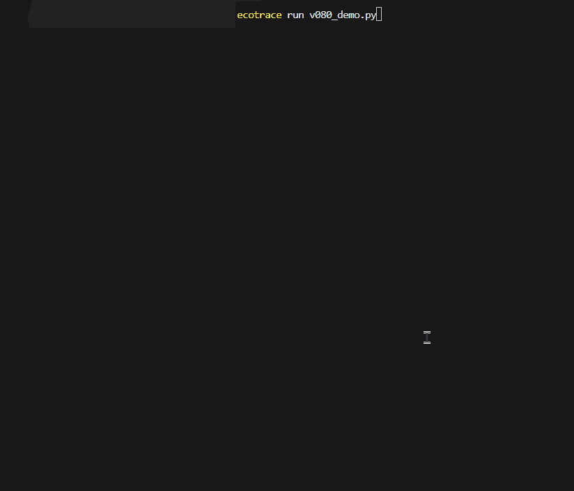

<div align="center">


# EcoTrace

### High-Precision Energy and Emissions Instrumentation
---
**v1.1.2 — Production/Stable Release.** Features OpenTelemetry export, Django/Celery integration, and critical stability improvements.
---

**EcoTrace is a lightweight library for granular carbon footprint measurement of Python applications. No configuration files, no background services—just real-time hardware-level transparency.**

Real-time monitoring | 50+ Global Zones | AI-powered insights | Zero-configuration

<br>

[](https://pypi.org/project/ecotrace/)
[](https://www.python.org/downloads/)
[](https://opensource.org/licenses/MIT)
[](https://pepy.tech/project/ecotrace)
[](https://ecotrace.readthedocs.io/en/latest/?badge=latest)
[](https://marketplace.visualstudio.com/items?itemName=ecotrace-team.ecotrace-monitor)

<br>

> [!TIP]
> **VS Code Extension:** Monitor application carbon footprint in real-time during development. [Download here](https://marketplace.visualstudio.com/items?itemName=ecotrace-team.ecotrace-monitor).

<br>



*Function-level carbon measurement with real-time monitoring*

</div>

---

## Core Features in v1.1.2

> **Enterprise-Grade Monitoring & Export.** v1.1.2 adds OpenTelemetry export for cloud platforms, framework integrations, and critical stability enhancements.

- **OpenTelemetry Exporter** — Export carbon metrics to Grafana, Datadog, New Relic, and Prometheus without blocking your application.
- **Django & Celery Middleware** — WSGI/ASGI request tracking and Celery task-level carbon measurement with response headers and worker signal cleanup.
- **Session Management** — Class-level atexit handlers with WeakSet instances prevent memory leaks on repeated module reloads.
- **Exception Transparency** — User exceptions now properly propagate after measurement teardown; measurement errors no longer mask failures.
- **Platform Reliability** — PowerShell `Get-CimInstance` (Windows) and `dmidecode` with sudo fallback (Linux) for robust RAM detection.
- **Critical Fixes** — Gemini lazy-loading, cached CPU info reuse, USER_AGENT fallbacks, and version checker robustness. See [CHANGELOG.md](CHANGELOG.md).

---

## Quick Install

```bash
pip install ecotrace
```

Optional extras:
```bash
pip install ecotrace[gpu]   # NVIDIA GPU support
pip install ecotrace[ai]    # Gemini AI insights
pip install ecotrace[all]   # Everything
```

---

## Quick Start

### Option 1: Zero-Code Profiling (CLI)
Measure any script without changing a single line of code:

```bash
ecotrace run my_script.py
```

### Option 2: Programmatic Tracking (Library)
Decorate functions for granular instrumentation:

```python
from ecotrace import EcoTrace

eco = EcoTrace(region_code="US")

@eco.track
def my_function():
    # Your heavy processing here
    pass

my_function()

# Export audit-ready reports or check cumulative totals
eco.generate_pdf_report("carbon_audit.pdf")
print(f"Total Carbon Emitted: {eco.total_carbon} gCO2")
```

### Option 3: Carbon Budget Mode
Set a limit and let EcoTrace enforce it:

```python
eco = EcoTrace(
    region_code="TR",
    carbon_limit=5.0,                   # 5 gCO2 budget
    on_budget_exceeded=lambda t, l: print(f"Budget exceeded: {t:.4f}/{l:.4f} gCO2")
)

@eco.track
def training_pipeline():
    ...

training_pipeline()
print(f"Remaining budget: {eco.remaining_budget} gCO2")
```

### Expected Output
When initialized, EcoTrace performs automated hardware detection:

```text
[EcoTrace] INFO: [INFO] EcoTrace instrumentation session initialized (STATIC).
[EcoTrace] INFO: -----------------------------------------------------
[EcoTrace] INFO: Region        : TR (475 gCO2/kWh)
[EcoTrace] INFO: Hardware Logic: 13th Gen Intel Core i7-13700H
[EcoTrace] INFO: Specifications: 20 Cores | 45.0W TDP
[EcoTrace] INFO: Energy Sensor : Boavizta Advanced Estimation
[EcoTrace] INFO: Memory Config : 15.6 GB DDR4
[EcoTrace] INFO: GPU Accelerator: Intel Iris Xe Graphics (15.0W TDP)
[EcoTrace] INFO: -----------------------------------------------------
```

At process exit, a session summary is printed automatically:

```text
=======================================================
  EcoTrace — Session Summary
=======================================================
  Duration       : 12.34s
  Functions      : 5 tracked
  Total Carbon   : 0.00312000 gCO2
  Region         : TR (475 gCO2/kWh)
  Budget         : 0.003120 / 5.000000 gCO2 (0.1%) [OK]
  Equivalent     : 0.4 min of LED bulb (10W)
=======================================================
```

---

## CI/CD Integration

### Official GitHub Action
Enforce carbon budgets in your pipeline with our official GitHub Action. Add this to your `.github/workflows/ci.yml`:

```yaml
- name: EcoTrace Carbon Gate
  uses: Zwony/ecotrace@core-v1.1.2
  with:
    budget: '10.0'
    region: 'US'
```

### Manual CLI Integration
You can also run the gate manually:
```bash
ecotrace gate --budget 10.0
```

If total emissions exceed the budget, the gate fails with exit code 1 — preventing carbon-heavy code from being merged.

---

## Why EcoTrace?

| Feature | **EcoTrace v1.0** | CodeCarbon | CarbonTracker |
|---|:---:|:---:|:---:|
| **Sampling Interval** | **50ms** | 15s | Per Epoch |
| **Isolation** | **Process-scoped** | System-wide | System-wide |
| **Budget Enforcement** | **Built-in** | No | No |
| **CI/CD Gate** | **Built-in** | No | No |
| **Idle Noise Subtraction** | **Automatic** | No | No |
| **Async Support** | **Native** | Limited | No |

- **Deep Transparency:** Derived from verified manufacturer TDP specifications rather than category averages.
- **Fail-Safe Architecture:** Guaranteed application continuity even if hardware drivers or API keys are missing.
- **Actionable AI:** Integrates with Google Gemini to provide specific code optimization advice (optional).

---

## Documentation

Full documentation is available at [**ecotrace.readthedocs.io**](https://ecotrace.readthedocs.io/en/latest/).

- [**Architecture and Science**](https://ecotrace.readthedocs.io/en/latest/ARCHITECTURE/) — How the energy model and process isolation work.
- [**Advanced Usage**](https://ecotrace.readthedocs.io/en/latest/USAGE/) — GPU tracking, AI insights, benchmarks, and comparison tables.
- [**API Reference**](https://ecotrace.readthedocs.io/en/latest/api/) — Technical documentation for core classes and functions.
- [**Support and Reference**](https://ecotrace.readthedocs.io/en/latest/SUPPORT/) — Troubleshooting, region codes, and hardware compatibility.

---

## Contributing

We welcome contributions! Please see our [**CONTRIBUTING.MD**](CONTRIBUTING.MD) for guidelines on reporting bugs, suggesting features, or contributing hardware data.

---

## Community

[](https://discord.gg/hs58XXb3Uq)

[CHANGELOG.md](CHANGELOG.md) · [SECURITY.MD](SECURITY.MD)

---

## Author and License

**Emre Ozkal** — [GitHub](https://github.com/Zwony) · [ecotraceteam@gmail.com](mailto:ecotraceteam@gmail.com)

MIT License — Use it however you like.

<div align="center">

*Developed for sustainable software development practices.*

</div>
