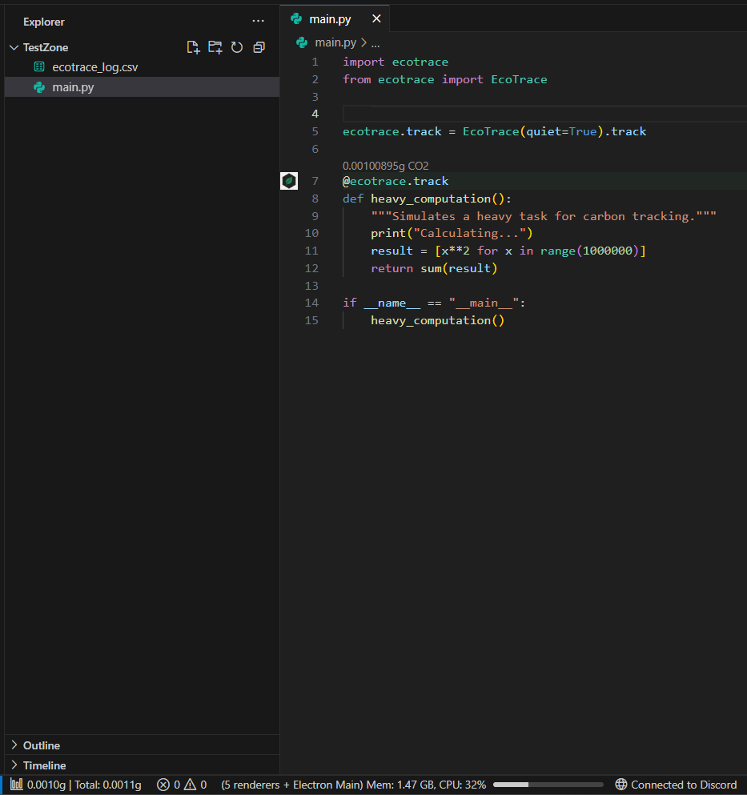

# EcoTrace - See the Carbon Cost of Every Function, Live in Your Editor.



EcoTrace brings real-time carbon footprint monitoring directly into VS Code. As you run your Python code, you see exactly how much CO2 each function emitted - displayed above the function, in your status bar, and compiled into a full PDF report.

**Sneak Peek: v1.0.1 is coming.** Soon introducing AI-powered code optimization, carbon budget enforcement, and intuitive carbon equivalence metrics.

---

## Upcoming Features (v1.0.1)

### AI-Powered Optimization
Click the "AI Optimize" button directly above any function. EcoTrace will analyze your code's carbon footprint and suggest a greener, more energy-efficient implementation using Google Gemini AI.

### Carbon Budget Gauge
A visual progress bar in the sidebar tracks your total session carbon against your set budget.
- **Green:** Under budget.
- **Yellow:** Approaching 80% of your limit.
- **Red:** Budget exceeded.

### Human-Readable Equivalences
Carbon metrics are converted into relatable comparisons for better context:
- ≈ 4.2 Google searches
- ≈ 15 min of LED bulb time
- ≈ 3 smartphone charges

### Real-Time Metrics & CodeLens
Function-level carbon emissions appear directly above your code and update on every run. 
```python
# 0.0010g CO2 (≈ 5 smartphone charges)
@ecotrace.track
def process_data():
    ...
```

---

## 🛠️ Getting Started

### 1. Install the Python library
```bash
pip install ecotrace
```

### 2. Instrument your functions
```python
from ecotrace import EcoTrace
eco = EcoTrace(region_code="US")

@eco.track
def my_function():
    ...
```

### 3. (Optional) Set up AI Insights
To use the **✨ AI Optimize** feature, add your [Google Gemini API Key](https://aistudio.google.com/app/apikey) in VS Code Settings:
`EcoTrace → Gemini API Key`

---

## ⚙️ Configuration

| Setting | Description | Default |
|---|---|---|
| `ecotrace.carbonBudget` | Session carbon threshold (gCO2) before warning | `10.0` |
| `ecotrace.geminiApiKey` | Your Google Gemini API Key for AI Insights | `""` |
| `ecotrace.region` | ISO 3166-1 alpha-2 region code for intensity | `GLOBAL` |

---

## Requirements

- VS Code `1.80.0` or higher
- Python `3.9+`
- `ecotrace` Python library (`pip install ecotrace`)

---

## Repository
Visit the project on [GitHub](https://github.com/Zwony/ecotrace).

*EcoTrace - Carbon observability for developers who care about what their code actually costs.*
